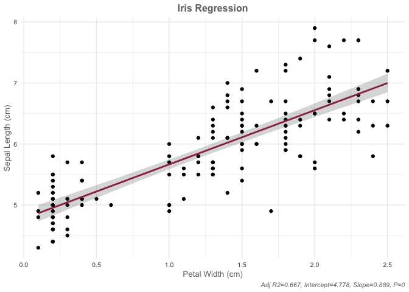

# How to make an R library: starting with nothing!

* Optional but recommended: *

- Open your Terminal 
- Install the rproj module with pip
- Install the GitHub CLI
```shell
pip install git+https://github.com/zhuchcn/Rproj.git
brew install gh
```

<!-- - Create folder for library. Name of folder will be name of library (make sure your working directory is whichever folder you want your new library repo to be)
```shell
mkdir cunivis # NOT RUN
cd cunivis # NOT RUN
``` -->

- Initialize git and stuff
- Make sure to elect to make a `.gitignore` file, with R framework
  + Add .DS_Store to your `.gitignore` too (before making any commits)
```shell
gh auth login
gh repo create cunivis
cd cunivis
rproj R
# git init main
git pull --set-upstream origin main
git add . && git commit -m "initial commit"
git push
```

- Start RStudio in your new RProj project setup
```shell
open R.Rproj
```


# Start doing stuff in R!


Ensure have the packages you need installed
```R
pkgs <- c("devtools", "roxygen2")
for (pkg in pkgs){
    if(!pkg %in% installed.packages()){install.packages(pkg)}
}
devtools::create("../cunivis")
system("open cunivis.Rproj")
quit()
```

- Re-open this README.md file in your new RStudio window
- Remove that original R.Rproj file we created earlier

```R
system("rm R.Rproj")
```

- Make your first R file to fill with functions!
```R
# list.files("R", recursive=T)
system("touch R/functions.R")
system("open R/functions.R")

```

- Put a function in your new functions.R file!
  + Make sure to indicate your package dependencies. Our package currently only depends upon `ggplot2` and `plotly`, so note where I wrote `#' @import ggplot2` and `#' @importFrom plotly ggplotly` in the lines below/in the `R/functions.R` file.
    - We're using `importFrom` for the `ggplotly` function of the `plotly` library because we don't need to import the whole library. We only need one function. This helps avoid conflicts with other packages.
  + Put the name of your function after the tag `#' @name`. Ours is `ggplot_lm`
  + Be sure to tag your function for export, or else it won't be available for the end user in your package. See where I put  `#' @export`  below. 
  + The example usage (`#' @examples`) is optional, but recommended for clarity on how to use your function.
  + A title/description of your function is helpful too (tag `#' @title`. That's the line that starts with `#' Helper function`... in the snippet below
  + Detailing your parameters is also helpful, but I'm too lazy to do it here too, using the `#' @param` tag. IE: `@param lm_output Basic \code{lm()} regression output`
  + There are some other optional tags you can use too, like `@keyword` but you can read up more on those online
- Example snipped for this tutorial (from our `man/functions.R` file):

```functions.R
#' @import ggplot2

#' @title  Helper function for easily plotting a linear regression model fit using polished ggplot and/or plotly aesthetics
#' @name ggplot_lm
#' @export
#' @examples
#' fit <- lm(Sepal.Length ~ Petal.Width, data=iris)
#' ggplot_lm(lm_output=fit)
#' ggplot_lm(lm_output=fit) + ggplot2::labs(title="Iris Regression", x="Petal Width (cm)", y="Sepal Length (cm)")
#' ggplot_lm(lm_output=fit, to_plotly=T)
ggplot_lm <- function(lm_output, xvar_name=names(lm_output$model)[2], yvar_name=names(lm_output$model)[1], fill=NULL, alpha=NULL, shape=NULL, size=NULL, to_plotly=F){
  PLOT <- ggplot2::ggplot(lm_output$model, ggplot2::aes_string(x=xvar_name, y=yvar_name)) +
    ggplot2::geom_point(ggplot2::aes_string(fill=fill, alpha=alpha, shape=shape, size=size)) +
    ggplot2::stat_smooth(method="lm", col="maroon", se=F, formula = "y ~ x") +
    ggplot2::geom_ribbon(stat="smooth", method="lm", alpha=.2, formula = "y ~ x") +
    ggplot2::labs(#title=title,
                  caption=paste0("Adj R2=", round(signif(summary(lm_output)$adj.r.squared, 5),  digits=3),
                                 ", Intercept=", round(signif(lm_output$coef[[1]],5), digits=3),
                                 ", Slope=",round(signif(lm_output$coef[[2]], 5),  digits=3),
                                 ", P=",round(signif(summary(lm_output)$coef[2,4]), digits=5))
    ) +
    ggplot2::theme_minimal(base_size=10) +
    ggplot2::theme(
      plot.title = ggplot2::element_text(hjust=.5, color="#707070", face="bold"),
      axis.title = ggplot2::element_text(color="#707070"),
      plot.caption = ggplot2::element_text(color="#707070", face="italic")
    )
  if(to_plotly){
    PLOT <- plotly::ggplotly(PLOT)
  }
  return(PLOT)
}
```

Here's how our document structure looks for our `cunivis` repo at this point:

```shell
MacBook-Pro-3:cunivis rhoadss$ tree
.
├── DESCRIPTION
├── NAMESPACE
├── R
│   └── functions.R
├── README.md
└── cunivis.Rproj

1 directory, 5 files
```


- Now, use `roxygen2`'s `roxygenize` function to auto-prepare most of the related necessary documentation/to update any changes you've made since your last build
  + This will create your `man` subdirectory with a separate `.Rd` file for each function you've indicated to `#' @export` in any `.R` files in your `R` subdirectory.
  + This step will also create your `DESCRIPTION` file, automatically listing your package name, version, etc...
  + It'll also update your `NAMESPACE` file to indicate exports for each of your package's functions

RUN:
```R
roxygen2::roxygenise(clean=T)
```

Our namespace should look like this now...
```NAMESPACE
# Generated by roxygen2: do not edit by hand

export(ggplot_lm)
import(ggplot2)

```
Our new DESCRIPTION file should look something like this:
```DESCRIPTION
Package: cunivis
Title: What the Package Does (One Line, Title Case)
Version: 0.0.0.9000
Authors@R: 
    person("First", "Last", , "first.last@example.com", role = c("aut", "cre"),
           comment = c(ORCID = "YOUR-ORCID-ID"))
Description: What the package does (one paragraph).
License: `use_mit_license()`, `use_gpl3_license()` or friends to pick a
    license
Encoding: UTF-8
LazyData: true
Roxygen: list(markdown = TRUE)
RoxygenNote: 7.1.2
```

Our new document structure should look like this:
```shell
MacBook-Pro-3:cunivis rhoadss$ tree
.
├── DESCRIPTION
├── NAMESPACE
├── R
│   └── functions.R
├── README.md
├── cunivis.Rproj
└── man
    └── ggplot_lm.Rd

2 directories, 6 files
```

Where our new `man` directory has a new `.Rd` file for our new `ggplot_lm` function! That `.Rd` file should have contents like this:
ggplot_lm.Rd
```latex
% Generated by roxygen2: do not edit by hand
% Please edit documentation in R/functions.R
\name{ggplot_lm}
\alias{ggplot_lm}
\title{Helper function for easily plotting a linear regression model fit using polished ggplot and/or plotly aesthetics}
\usage{
ggplot_lm(
  lm_output,
  xvar_name = names(lm_output$model)[2],
  yvar_name = names(lm_output$model)[1],
  fill = NULL,
  alpha = NULL,
  shape = NULL,
  size = NULL,
  to_plotly = F
)
}
\description{
Helper function for easily plotting a linear regression model fit using polished ggplot and/or plotly aesthetics
}
\examples{
fit <- lm(Sepal.Length ~ Petal.Width, data=iris)
ggplot_lm(lm_output=fit)
ggplot_lm(lm_output=fit) + ggplot2::labs(title="Iris Regression", x="Petal Width (cm)", y="Sepal Length (cm)")
ggplot_lm(lm_output=fit, to_plotly=T)
}
```


- Now, run `devtools::document()` to finish up creating the rest of the required documentation

```R
devtools::document() 
```


- Now, you can commit/push all your changes and then install your very own homemade package!
```shell
git add . && git commit -m "initial library documented + publishing"
git push
```

## INSTALL YOUR PACKAGE IN R!
```r
devtools::install_github("srhoads/cunivis")
```

Output will look something like this...
```
> devtools::install_github("srhoads/cunivis")
Downloading GitHub repo srhoads/cunivis@HEAD
✓  checking for file ‘/private/var/folders/s4/vcf5kd_513q0nw8nz38gcx880000gq/T/Rtmp7250Mt/remotes258d38361d53/srhoads-cunivis-e8f6dee/DESCRIPTION’ ...
─  preparing ‘cunivis’:
✓  checking DESCRIPTION meta-information ...
─  checking for LF line-endings in source and make files and shell scripts
─  checking for empty or unneeded directories
─  building ‘cunivis_0.0.0.9000.tar.gz’
   
* installing *source* package ‘cunivis’ ...
** using staged installation
** R
** byte-compile and prepare package for lazy loading
** help
*** installing help indices
** building package indices
** testing if installed package can be loaded from temporary location
** testing if installed package can be loaded from final location
** testing if installed package keeps a record of temporary installation path
* DONE (cunivis)
```

FOR YOUR FUTURE MODIFICATIONS OF YOUR R FUNCTIONS/CODE/OTHER ASPECTS OF THE PACKAGE:

- Each time I make a change to my library, I typically re-run this set of code to auto-update the documentation files, commit the changes, push them to GitHub, and then re-install my updated package:

```r

roxygen2::roxygenise(clean=T)
devtools::document() 
system('git add . && git commit -m "R function updates" && git push') # stage, commit, and push your changes using git commands
devtools::install_github("srhoads/cunivis") # re-install your package to your machine

```

# Example of ggplot output of our `ggplot_lm` function:

Code used to create this example plot:
```r
if(!("cunivis") %in% installed.packages()){devtools::install_github("srhoads/cunivis")}
fit <- lm(Sepal.Length ~ Petal.Width, data=iris)
gg <- cunivis::ggplot_lm(lm_output=fit) + ggplot2::labs(title="Iris Regression", x="Petal Width (cm)", y="Sepal Length (cm)")
gg
```




<br>

<hr>

<br>


### IGNORE/MISC


```r
if(!("cunivis") %in% installed.packages()){devtools::install_github("srhoads/cunivis")}
library(cunivis)
fit <- lm(Sepal.Length ~ Petal.Width, data=iris)
gg <- ggplot_lm(lm_output=fit) + ggplot2::labs(title="Iris Regression", x="Petal Width (cm)", y="Sepal Length (cm)")
htmlwidgets::saveWidget(plotly::ggplotly(gg), file = "examplePlot.html");
htmlCode <- readLines("examplePlot.html") %>% paste0(., collapse="\n")

encodeGraphic <- function(g) {
  png(tf1 <- tempfile(fileext = ".png"))  # Get an unused filename in the session's temporary directory, and open that file for .png structured output.
  print(g)  # Output a graphic to the file
  dev.off()  # Close the file.
  txt <- RCurl::base64Encode(readBin(tf1, "raw", file.info(tf1)[1, "size"]), "txt")  # Convert the graphic image to a base 64 encoded string.
  myImage <- htmltools::HTML(sprintf('', txt))  # Save the image as a markdown-friendly html object.
  return(myImage)
}

hg <- encodeGraphic(gg) 
forHTML <- list(htmltools::h1("My header"), htmltools::p("Lead-in text about the graph"), hg)
htmltools::save_html(forHTML, "examplePlot2.html")  # output it to the html file.
htmlCode2 <- forHTML %>% unlist() %>% paste0(., collapse="\n")
```


```r
> roxygen2::roxygenise(clean=T)
ℹ Loading cunivis
Writing NAMESPACE
Writing NAMESPACE
Warning messages:
1: 
── Conflicts ──────────────────────────────────────────────────────────────────────────────────────────────────────────────────────────────────────────────────────────────────────────────── cunivis conflicts ──
x ggplot_lm() masks cunivis::ggplot_lm()

Did you accidentally source a file rather than using `load_all()`?
Run `rm(list = c("ggplot_lm"))` to remove the conflicts. 
2: ggplot_lm.Rd is missing name/title. Skipping 
```


```r
> rm(ggplot_lm)
> roxygen2::roxygenise(clean=T)
ℹ Loading cunivis
Writing NAMESPACE
Writing NAMESPACE
There were 17 warnings (use warnings() to see them)
>
> warnings()
Warning messages:
1: In loadNamespace(i, c(lib.loc, .libPaths()), versionCheck = vI[[i]]) :
  there is no package called ‘and/or’
2: In loadNamespace(i, c(lib.loc, .libPaths()), versionCheck = vI[[i]]) :
  there is no package called ‘for’
3: In loadNamespace(i, c(lib.loc, .libPaths()), versionCheck = vI[[i]]) :
  there is no package called ‘function’
4: In loadNamespace(i, c(lib.loc, .libPaths()), versionCheck = vI[[i]]) :
  there is no package called ‘Helper’
5: In loadNamespace(i, c(lib.loc, .libPaths()), versionCheck = vI[[i]]) :
  there is no package called ‘a’
6: In loadNamespace(i, c(lib.loc, .libPaths()), versionCheck = vI[[i]]) :
  there is no package called ‘aesthetics’
7: In loadNamespace(i, c(lib.loc, .libPaths()), versionCheck = vI[[i]]) :
  there is no package called ‘easily’
8: In loadNamespace(i, c(lib.loc, .libPaths()), versionCheck = vI[[i]]) :
  there is no package called ‘fit’
9: In loadNamespace(i, c(lib.loc, .libPaths()), versionCheck = vI[[i]]) :
  there is no package called ‘ggplot’
10: In loadNamespace(i, c(lib.loc, .libPaths()), versionCheck = vI[[i]]) :
  there is no package called ‘linear’
11: In loadNamespace(i, c(lib.loc, .libPaths()), versionCheck = vI[[i]]) :
  there is no package called ‘model’
12: replacing previous import ‘ggplot2::last_plot’ by ‘plotly::last_plot’ when loading ‘cunivis’
13: In loadNamespace(i, c(lib.loc, .libPaths()), versionCheck = vI[[i]]) :
  there is no package called ‘plotting’
14: In loadNamespace(i, c(lib.loc, .libPaths()), versionCheck = vI[[i]]) :
  there is no package called ‘polished’
15: In loadNamespace(i, c(lib.loc, .libPaths()), versionCheck = vI[[i]]) :
  there is no package called ‘regression’
16: In loadNamespace(i, c(lib.loc, .libPaths()), versionCheck = vI[[i]]) :
  there is no package called ‘using’
17: ggplot_lm-Helper-function-for-easily-plotting-a-linear-regression-model-fit-using-polished-ggplot-and-slash-or-plotly-aesthetics.Rd is missing name/title. Skipping
```


HELPFUL ALIAS FUNCTION EXPORTING:
https://github.com/r-lib/roxygen2/issues/825

